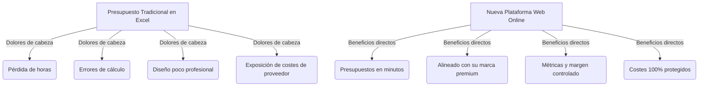

# 🎨 Propuesta Comercial & Guía de Uso: Plataforma de Presupuestos Premium
> **De la tortura de Excel al Diseño de Presupuestos de Alta Gama en un Clic.**

Este documento está diseñado en dos partes:
1. **Hoja de Venta Comercial**: Los argumentos clave y la estructura para convencer a tu cliente (estudios de interiorismo, decoradores, reformistas) de abandonar Excel y adoptar tu plataforma online.
2. **Guía Rápida de Uso**: Un manual paso a paso que puedes entregarle al cliente o usar tú mismo durante la demostración en vivo de la demo: [https://ch-iota-orcin.vercel.app/](https://ch-iota-orcin.vercel.app/).

---

## Part 1: Hoja de Venta (Pitch Comercial)
*Usa esta estructura para presentar el proyecto y destacar por qué Excel está limitando su negocio.*



### 1. El Diagnóstico: La "Trampa" de Excel
> *"Pasas horas delante de una hoja de cálculo gris, cuadriplicando celdas, calculando el IVA a mano, y cuando se lo envías al cliente, el diseño no refleja la calidad de tu trabajo. Peor aún: un error en una fórmula puede costarte miles de euros, o puedes acabar filtrando por error el nombre de tu proveedor y tus márgenes de beneficio."*

| El Problema con Excel | La Solución con tu Plataforma Web |
| :--- | :--- |
| ❌ **Horas perdidas**: Copiar y pegar descripciones, buscar imágenes y formatear tablas desde cero en cada proyecto. | 🚀 **Velocidad de rayo**: Importación directa desde Excel con un clic, uso de plantillas y catálogo reutilizable. |
| ❌ **Errores fatales**: Pérdida de fórmulas, celdas que no cuadran e IVA calculado incorrectamente. | 🎯 **Precisión quirúrgica**: Cálculos automáticos e infalibles de márgenes, IVA, descuentos comerciales y gastos de gestión. |
| ❌ **Falta de estética**: Hojas de cálculo frías y cuadriculadas que restan valor y prestigio a tu marca de lujo. | ✨ **Diseño Editorial Premium**: Tipografías elegantes, formato lookbook con imágenes, valoración conceptual y PDF de alta gama. |
| ❌ **Información expuesta**: Riesgo de que el cliente final vea tus costes de compra o tus distribuidores exclusivos. | 🔒 **Seguridad Absoluta**: Separación de la Hoja de Trabajo (costes y proveedores) de la Propuesta del Cliente (PVP final). |

---

### 2. Los 5 Pilares de Valor (Qué le estás vendiendo)

#### 🌐 Acceso Online Multi-Dispositivo
Tu cliente ya no depende de tener el archivo de Excel guardado en su ordenador local de la oficina. Al estar en la nube (respaldado de forma segura y gratuita con **Supabase**), puede revisar, editar o presentar un presupuesto desde su ordenador, tablet o directamente desde el móvil mientras está en una obra.

#### 🛡️ Seguridad de Datos y Privacidad
El mayor peligro del interiorismo es que el cliente final "se salte" al diseñador buscando los muebles directamente en Google. En esta app, la base de datos mantiene a salvo los códigos de producto, los enlaces de compra y los distribuidores. El cliente final solo ve una descripción pulida, fotos conceptuales inspiradoras y el precio final de venta.

#### 📊 Dashboard de Métricas en Tiempo Real
Visualización inmediata de la rentabilidad del proyecto. De un vistazo, el decorador sabe:
* Cuál es la **Inversión Total** necesaria para comprar los materiales.
* Cuál es el **Presupuesto Total (Venta)** facturado.
* El **Beneficio Neto Estimado** y el **Margen Comercial exacto (en %)**. 
*Esto le permite negociar descuentos con proveedores sabiendo exactamente hasta dónde puede bajar.*

#### 📁 Importador en Bloque (Excel Importer)
¿Tienen presupuestos antiguos o catálogos en Excel? La app incluye un importador inteligente. Solo tienen que seleccionar las columnas de su Excel, copiarlas y pegarlas en el asistente para crear un presupuesto completo en menos de 10 segundos.

#### 📄 Propuesta del Cliente Editorial e Impresión Premium
Una vista optimizada tipo revista de diseño de interiores. Incluye:
* **Memoria conceptual de diseño** en tipografía serif premium.
* **Fotos conceptuales** integradas de cada mueble u obra.
* Opciones de **Impresión a PDF** sin cabeceras web, perfecta para enviar por email.
* Botón de **"Copiar Texto"**: Genera una estructura elegante en texto plano lista para pegar en WhatsApp o en un correo electrónico.

---

## Part 2: Guía de Uso Paso a Paso
*Sigue esta guía detallada para hacer una demo impecable a tu cliente y enseñarle a sacarle partido a la plataforma.*

### Paso 1: Acceso y Selección de Proyecto
1. Abre en tu navegador la demo: [https://ch-iota-orcin.vercel.app/](https://ch-iota-orcin.vercel.app/).
2. Verás la pantalla de **Proyectos del Estudio (Landing)**. 
3. Muestra el proyecto estrella **"LOS NARANJOS NUEVA ANDALUCIA"** haciendo clic en **"Entrar al Editor"**. Esto demostrará que la app puede gestionar múltiples obras y clientes de forma simultánea.

```
💡 Tip de Venta: Explica que la app recuerda el último proyecto en el que trabajaron para que puedan retomar las tareas al instante.
```

---

### Paso 2: La Hoja de Trabajo (El "Excel" Inteligente)
1. Cambia a la pestaña **"Hoja de Trabajo"** en el menú superior.
2. Muestra cómo se organiza el presupuesto por zonas físicas de la vivienda (p. ej., *Bedroom 1*, *Bedroom 2*, *Bathroom*, *Master Bedroom*, *Salon*).
3. **Agrega un elemento en vivo**: Haz clic en *"Añadir Artículo"* en cualquier sección. Escribe una descripción (p. ej., *"Espejo con marco dorado antiguo"*), introduce la cantidad (p. ej., `1`), el coste del distribuidor (p. ej., `150 €`) y el PVP para el cliente (p. ej., `320 €`).
4. Observa cómo, al instante de escribir, los **KPIs de margen y beneficio estimado en la parte superior se actualizan en tiempo real**.

---

### Paso 3: Gestión de Márgenes y Ajustes Globales
En la misma Hoja de Trabajo, muestra lo fácil que es aplicar ajustes que en Excel tomarían horas de fórmulas complejas:
1. Haz clic en **"Ajustes del Presupuesto"** en la barra lateral o cabecera.
2. Introduce un **Descuento Comercial** general (p. ej., un `5%` de descuento) o unos **Gastos de Gestión Administrativa** (p. ej., `350 €`).
3. Marca o desmarca la opción de **Calculo de IVA** (calculado al 21% o 10% según la obra).
4. Muestra cómo el sistema recalcula la base imponible y el total del presupuesto automáticamente.

---

### Paso 4: La Propuesta de Venta para el Cliente
1. Cambia al modo **"Propuesta Cliente"** en la cabecera.
2. **¡El Efecto Wow!** Explica al cliente: *"Mira cómo ha cambiado el diseño. Desaparecieron los distribuidores, desaparecieron tus márgenes internos. Ahora es una propuesta limpia, de lujo, digna de un estudio de alta decoración."*
3. Muestra las dos opciones de visualización:
   * **Formato Técnico**: Un desglose limpio por zonas.
   * **Formato Editorial (Fotos)**: Carga las fotografías conceptuales de los artículos seleccionados en un formato lookbook impresionante.
4. **Agrega la Memoria de Diseño**: Haz clic en *"Editar Concepto"* e introduce una descripción poética del diseño (p. ej., *"Una atmósfera que fusiona la calidez del roble con texturas orgánicas de lino..."*). Muestra cómo se integra de manera elegante en la cabecera.
5. Haz clic en **"Copiar Texto"** y explícale: *"Si tu cliente te pide el presupuesto por WhatsApp, solo tienes que hacer clic aquí y pegarlo. Se envía un resumen perfectamente formateado con emojis en un segundo."*
6. Haz clic en **"Imprimir / Guardar PDF"** para mostrar cómo la página se adapta automáticamente al papel, ocultando los botones web y creando un PDF impecable para adjuntar por correo.

---

### Paso 5: Métricas y Dashboard del Estudio
1. Cambia al modo **"Métricas"** en la cabecera.
2. Enseña el gráfico interactivo de la rentabilidad del proyecto:
   * Distribución del presupuesto por estancias (para ver dónde se gasta más el cliente).
   * Cuota de compras por proveedor (para gestionar los pedidos de compra a Zara Home, Kave Home, etc.).
   * Estimaciones de tiempos y estado de entrega de los artículos (*disponible*, *pedido*, *entregado*).

---

## 🎯 El Cierre de la Venta: La Propuesta del Desarrollo (con Supabase)
Para cerrar el trato, explícale cómo su negocio va a cambiar:
> *"Esta demo que estás viendo funciona de manera local, pero lo que te propongo es instalar tu base de datos **Supabase** de manera profesional. Esto significa que todo tu equipo de diseñadores podrá trabajar al mismo tiempo, los datos estarán totalmente seguros, se guardarán copias de seguridad automáticas en la nube cada día y podrás consultar tus presupuestos históricos desde cualquier rincón del mundo de forma 100% gratuita gracias a sus planes flexibles. Es la transformación digital que tu estudio necesita para ahorrar tiempo y proyectar una imagen ultra-profesional."*
