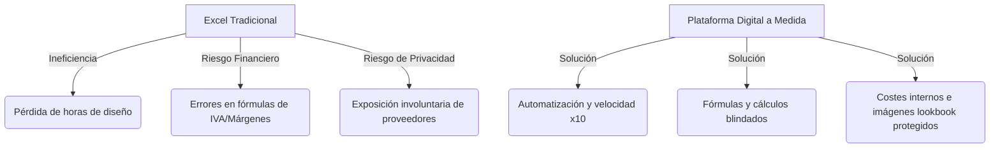

# 📄 Dossier de Valoración Comercial & Retorno de Inversión (ROI)
> **Plataforma de Control de Presupuestos & CRM para Estudios de Interiorismo**

---

## 💎 1. Propuesta de Valor Única (El "Por Qué")

El software diseñado para la automatización de presupuestos resuelve de raíz las ineficiencias críticas que sufren los estudios de diseño y arquitectura al depender de hojas de cálculo tradicionales (Excel).

---

## 🎯 2. El Retorno de Inversión (ROI) para el Estudio

Presentar el software a un cliente requiere justificar la inversión en términos de **ahorro económico y ganancias de tiempo**.

### ⏱️ Escenario de Ahorro de Tiempo
* **Tiempo actual promedio en Excel**: 5 horas por presupuesto (búsqueda de fotos, copia de descripciones de proveedores, cálculo manual de márgenes, maquetación de tablas, cálculo de IVA y descuentos).
* **Tiempo promedio con la App Web**: 30 minutos (gracias al importador en bloque y cálculos automáticos).
* **Ahorro neto por proyecto**: 4.5 horas.
* **Valoración por hora del Interiorista / Director**: 50 €/hora.
* **Ahorro monetario por presupuesto realizado**: **225 €** de tiempo de alta productividad recuperado.

> [!TIP]
> **Cálculo de Amortización**: Si el estudio realiza **4 presupuestos al mes**, el software les ahorra **900 € mensuales** en productividad. La inversión inicial se recupera completamente en el primer trimestre.

### 🛡️ Escenario de Prevención de Errores Financieros
* En presupuestos residenciales típicos de entre 15.000 € y 45.000 €, un error del 2% en una suma o en la aplicación del IVA (p. ej. aplicar 10% en lugar de 21% por error en una celda) representa una **pérdida directa de entre 300 € y 900 €** que el estudio debe asumir de su propio bolsillo.
* La aplicación blinda las fórmulas, garantizando que el beneficio real del estudio esté 100% protegido.

---

## 💰 3. Propuestas de Modelos de Tarifas

Te presentamos tres modelos comerciales listos para presentar, según el tipo de cliente:

### 🏷️ Modelo A: Desarrollo Llave en Mano (Pago Único)
*Ideal para estudios consolidados que quieren tener la propiedad del software.*

* **Pago Inicial por Implantación**: **2.400 €**
  * Incluye: Personalización de marca (logotipo, colores, tipografía corporativa), hosting inicial, configuración de base de datos en la nube (Supabase) y formación al equipo (2 horas).
* **Cuota de Soporte & Mantenimiento Anual**: **190 €/año** (a partir del segundo año).
  * Cubre: Dominio web, SSL seguro, mantenimiento de la base de datos y corrección de incidencias.

---

### ☁️ Modelo B: Software como Servicio (SaaS - Suscripción Anual)
*Perfecto para estudios que prefieren no hacer un gran desembolso inicial y tratarlo como un gasto operativo mensual.*

* **Cuota de Alta e Importación Inicial**: **450 €** (pago único por configuración e importación de sus tarifas y proveedores actuales).
* **Suscripción Mensual**: **59 €/mes** (facturado anualmente en un solo pago de **708 €/año**).
* **Incluido**: Soporte técnico prioritario, actualizaciones de seguridad constantes y almacenamiento en la nube ilimitado.

---

### 🤝 Modelo C: Pago Híbrido (Puesta en Marcha + Suscripción Reducida)
*El modelo más equilibrado y fácil de vender por su bajo coste de entrada.*

* **Pago de Configuración Inicial**: **950 €**
* **Suscripción Mensual de Alojamiento**: **29 €/mes**
* **Incluido**: Alojamiento seguro, base de datos en tiempo real de Supabase y soporte técnico básico.

---

## 💎 4. Resumen de Características Exclusivas a Destacar

Cuando presentes la demo, haz hincapié en estos cuatro diferenciadores que **ninguna plantilla de Excel puede replicar**:

1. **La "Gran Muralla" de Privacidad**: El estudio trabaja con total libertad viendo costes de compra y distribuidores. Con un solo clic en *"Propuesta Cliente"*, toda esa información crítica desaparece y se genera un lookbook visual elegante para el cliente final.
2. **Importación Inteligente**: El usuario puede copiar columnas enteras de su Excel antiguo y pegarlas directamente. La aplicación las formatea e interpreta al instante.
3. **CRM de Proveedores Autocompletable**: Evita tener que teclear una y otra vez la información de contacto de fabricantes recurrentes (Zara Home, Kave Home, Flos, etc.).
4. **Logística Unificada**: Un panel que alerta en rojo si algún material está retrasado o pendiente de recibir para las obras activas, permitiendo controlar las entregas de forma eficiente.
